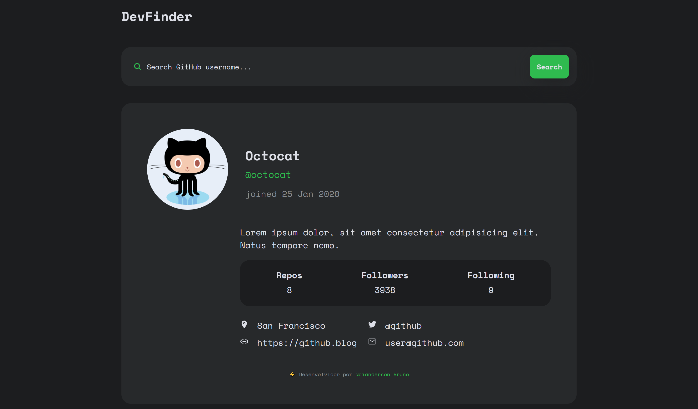

# ▶️  Sobre o projeto

DevFinder é um projeto baseado no desafio proposto no site [Frontend Mentor](https://www.frontendmentor.io/) que você pode encontrar [clicando aqui](https://www.frontendmentor.io/challenges/github-user-search-app-Q09YOgaH6).

O desafio consiste em construir um aplicativo de pesquisa de usuário do GitHub usando a [API de usuários do GitHub](https://docs.github.com/en/rest/reference/users#get-a-user). O aplicativo deve ser responsivo e se adaptar a qualquer tipo de tela.

### 📷 Screeshot

⚡ Experimente você mesmo: [demo](https://naiandersonb.github.io/devfinder/)  

### 💼 Construido com:

- HTML5
- Flexbox
- SCSS
- Mobile-first workflow

## 👽 Sobre o autor

- Instagram - [@naiandersonbruno_](https://www.instagram.com/naiandersonbruno_/)
- Frontend Mentor - [@naiandersonb](https://www.frontendmentor.io/profile/naiandersonb)
- Lnkedin - [Naianderson Bruno](www.linkedin.com/in/naianderson-bruno-franca)
